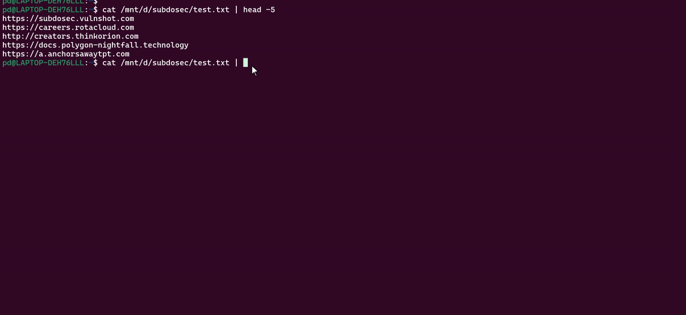
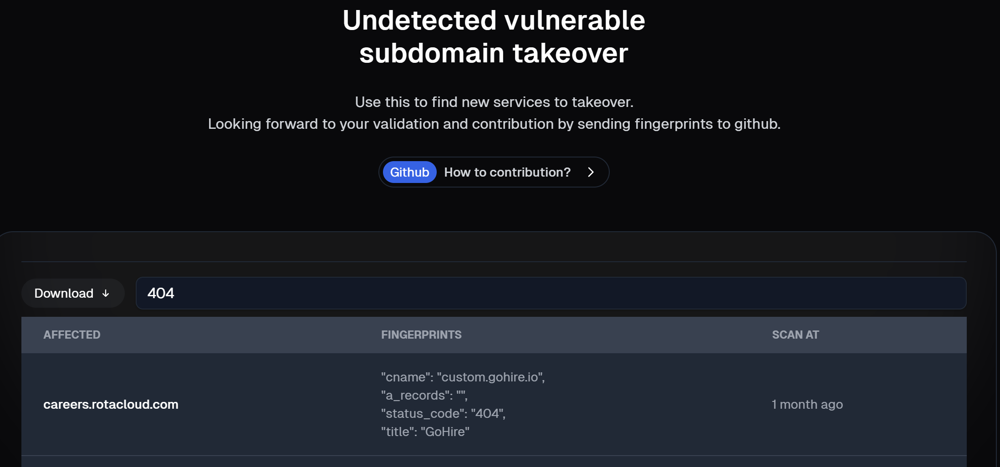

<p align="center">
<b>Subdosec</b>
</p>

<p align="center">
  <a href="#installation">Install</a> •
  <a href="#running-subdosec">Usage</a> •
  <a href="#web-based">Web Based</a> •
  <a href="#online-scan">Online scan</a> •
  <a href="https://t.me/+wss0Fj5zc81iM2Nl">Join Telegram</a>
</p>

---

Subdosec is not just a fast and accurate subdomain takeover scanner with no false positives. It also provides a complete database containing a list of sites vulnerable to subdomain takeover (public results), as well as detailed non-vuln subdomain metadata information such as IP, CNAME, TITLE, and STATUS CODE, which you can use for reconnaissance to find sites that may be vulnerable to subdomain takeover on new services.



---

# Installation

To install, simply run the following command: 
``python3 -m pip install git+https://github.com/xcapri/subdosec.git``. 
If there is an update, you can run the same command by adding the --upgrade argument.

---
# Running subdosec

```
$ subdosec -h
 ____        _         _
/ ___| _   _| |__   __| | ___  ___  ___  ___
\___ \| | | | '_ \ / _` |/ _ \/ __|/ _ \/ __|
 ___) | |_| | |_) | (_| | (_) \__ \  __/ (__
|____/ \__,_|_.__/ \__,_|\___/|___/\___|\___|


usage: main.py [-h] [-mode {private,public}] [-initkey INITKEY] [-vo] [-pe]

Web scanner.

options:
  -h, --help            show this help message and exit
  -mode {private,public}
                        Mode of operation (private/public)
  -initkey INITKEY      Initialize the API key
  -vo                   VULN Only: Hide UNDETECT messages
  -pe                   Print Error: When there are problems detecting your target

```

Every subdomain takeover scan will default to the public dashboard https://subdosec.vulnshot.com/scan#vulnlist, so the following commands can be used:
## Default scan 
- ``cat list_subdomain | subdosec ```, This command will display the UNDETECT & VULN scan output with the output publicly saved to the subdosec web as a database of vulnerable sites.
- ``cat list_root_domain | subfinder -silent | httpx -silent | subdosec``, you can also scan subdomains from the subfinder results directly.
## Private scan 
You need to create an account here: https://subdosec.vulnshot.com/signup. Simply use your email, and you will be given a Subdosec env file containing your password and API key. Use the API key to initialize the tool with the command:

``subdosec -initkey your-random-key``.

You can then use the password to login and view the scan results on the website (this is optional; the CLI output is sufficient). However, the scan results will still be available on the website in private mode, accessible only to logged-in users.
Final command:

```cat list_root_domain | subfinder -silent | httpx -silent | subdosec -mode private```

---
# Web Based

Knowing the function of the subdosec web, here you can use the https://subdosec.vulnshot.com/result/undetected feature as a reconnaissance, to find out IP, CNAME, TITLE, STATUS CODE, etc. as further information or even to find new takeover subdomains.

For example, you search for a site that is not detected as vulnerable by subdosec with the keyword *404*, and there is information on cname.gohire.io and the title GoHire, which if you search on Google, there is no article information about subdomain takeover on the gohire service.



After that you analyze it turns out that the service is vulnerable to subdomain takeover. then you can send the fingerprint information to us via telgram channel [Subdosec Group](https://t.me/+wss0Fj5zc81iM2Nl).

Dynamically you can use this element for rules ``title, cname, status_code, in_body, a_record, redirect``:

```
{
  "name": "Subdomain takeover - GoHire",
  "rules": {
    "cname": "custom.gohire.io",
    "in_body": "Page not found",
    "status_code": "404"
  },
  "status_fingerprint": 0,
  "reference": "https://help.gohire.io/en/articles/3385288-setting-up-a-custom-domain",
  "service": "gohire.io",
  "logo_service": "https://gohire-website.s3.amazonaws.com/img/logos/gh-logo-main.gif"
}
```

---

## Online scan

If you are not a person with a security background, maybe a web-dev/programmer and not familiar with cli tools. you can use the web version to scan all your subdomains with a max of 10 subdomains per scan.


# Best regards
xcapri & tegalsec
